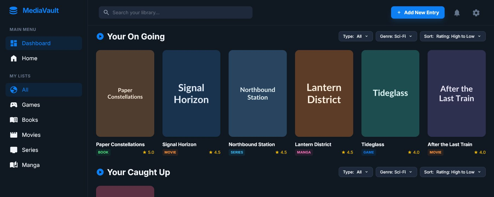
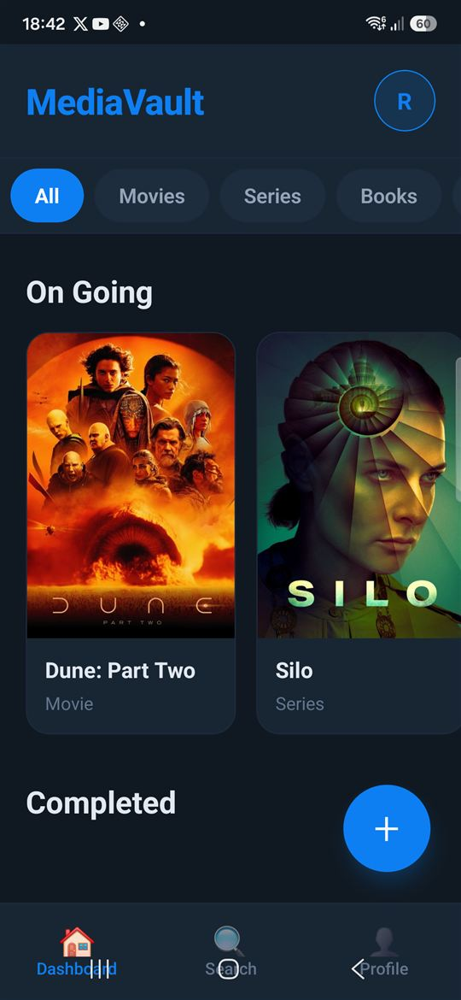
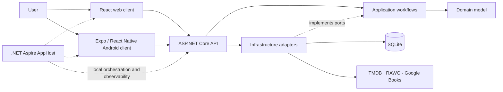

# MediaVault

MediaVault is a personal media library for movies, TV series, games, books,
and manga. It brings an ASP.NET Core API, a React web app, and an Android app
together in one development experience while keeping each codebase in its own
focused repository.

> **Status:** active pre-release portfolio project. The core authenticated
> library workflows work on web and Android; production deployment, app-store
> distribution, general offline sync, and AI recommendations remain roadmap
> work.

## Explore the code

| Repository | What it contains |
| --- | --- |
| **[MediaVault.Api](https://github.com/Megaraz/MediaVault.Api)** | .NET backend, domain and application layers, persistence, external metadata integrations, and backend tests |
| **[MediaVault.Clients](https://github.com/Megaraz/MediaVault.Clients)** | React web client, Expo/React Native Android client, shared TypeScript package, and client documentation |

This repository is the project front door and local Aspire workspace. The two
linked repositories contain the implementation-level documentation and retain
their own Git histories.

## Product tour

The screenshots use synthetic demo accounts and fictional library data.

### Web

The web dashboard groups library entries by status and supports media-type
filtering, search, sorting, and create/edit workflows.



### Android

The Android client provides the same core library workflows in an Expo/React
Native interface, including provider-backed metadata search.



## What MediaVault does

- Registers and authenticates users with JWT bearer authentication.
- Tracks movies, TV series, games, books, and manga in a personal library.
- Stores status, ratings, reviews, genres, artwork, release data, and
  type-specific metadata.
- Searches TMDB, RAWG, and Google Books through the backend, keeping provider
  credentials out of client bundles.
- Offers web and Android experiences over the same API contracts.
- Exposes local logs, traces, metrics, and resource state through the
  Aspire dashboard during development.

## Architecture



The backend remains authoritative for accounts and shared library data. Client
applications communicate through HTTP contracts; they never share the backend
SQLite file or receive third-party provider secrets.

### Tech stack

| Area | Technology |
| --- | --- |
| Backend | .NET 10, ASP.NET Core, Entity Framework Core, SQLite |
| Web | React 19, TypeScript, Vite, Tailwind CSS |
| Android | Expo SDK 54, React Native 0.81, Expo Router |
| Authentication | JWT bearer tokens; SecureStore on Android |
| Metadata | TMDB, RAWG, Google Books |
| Local orchestration | .NET Aspire 13 |
| Quality | xUnit, ESLint, TypeScript checks, GitHub Actions |

## Development setup

### Prerequisites

- Git
- [.NET 10 SDK](https://dotnet.microsoft.com/download/dotnet/10.0)
- Node.js 24 and npm (Expo SDK 54 requires Node.js 20.19 or newer)
- An Android emulator or physical device for the Android preset

Clone this workspace repository and run the setup script:

```powershell
git clone https://github.com/Megaraz/MediaVault.git
cd MediaVault
./setup.ps1
```

`setup.ps1` clones `MediaVault.Api` and `MediaVault.Clients` beside the AppHost.
It skips a repository when its directory already exists, so the same command is
safe to use when recreating the workspace on another computer.

To clone and install/restore all dependencies in one pass:

```powershell
./setup.ps1 -InstallDependencies
```

The resulting local layout is:

```text
MediaVault/
├── MediaVault.AppHost/  local Aspire orchestration
├── MediaVault.Api/      independent Git repository
├── MediaVault.Clients/  independent Git repository
├── setup.ps1
└── run.ps1
```

Before the first run, configure API user secrets and provider credentials as
described in the
[API setup guide](https://github.com/Megaraz/MediaVault.Api#run-locally).
For the Android client, review the
[client setup guide](https://github.com/Megaraz/MediaVault.Clients#run-locally)
and ensure an emulator or device is available.

## Run with Aspire

Launch the interactive menu:

```powershell
./run.ps1
```

Available presets are:

| Preset | Resources |
| --- | --- |
| `api` | Backend only |
| `web` | Backend and web client |
| `android` | Backend and Android client |
| `all` | Backend, web, and Android clients |

The menu remembers the most recent selection in a local ignored file. You
can select it with `L`, or bypass the menu for repeatable commands:

```powershell
./run.ps1 -Preset web
./run.ps1 -Preset all
```

Aspire opens its dashboard and starts the selected resources. The web app is
available at `https://localhost:61366`; the API uses
`http://localhost:5210`. The Android preset starts Expo with the emulator-safe
API address `http://10.0.2.2:5210`.

## Design choices

- **Separate repositories, one workspace:** backend and clients keep focused
  histories and CI while this repository provides the recruiter-friendly
  overview and reproducible local topology.
- **Backend-owned integrations:** external API credentials and provider payload
  mapping stay behind the API boundary.
- **API-authoritative data:** optional mobile SQLite is local persistence, not
  an implicit synchronization strategy.
- **Aspire for development:** AppHost coordinates processes and local
  observability; it is not presented as a production hosting platform.

## Roadmap

- Harden timeout, cancellation, retry, and rate-limit policies per boundary.
- Define and implement an explicit offline synchronization contract.
- Add production deployment, telemetry policy, and distribution workflows.
- Consolidate appropriate shared TypeScript contracts without coupling the
  clients to backend implementation details.
- Explore a narrow, privacy-conscious recommendation feature after the core
  product and operational boundaries are mature.

Work is tracked in the
[MediaVault GitHub Project](https://github.com/users/Megaraz/projects/2).

## License

MediaVault is available under the [MIT License](LICENSE.txt). Each sub-repository
also contains its own community and security policies.
